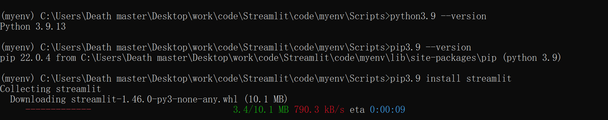
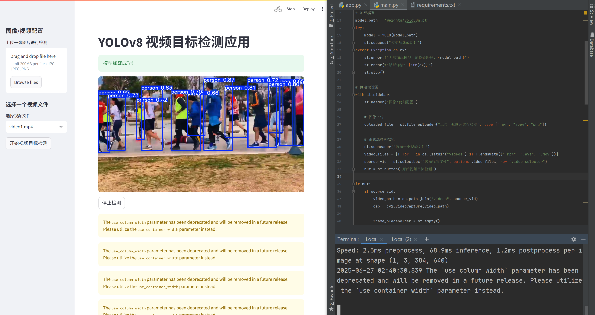

# Streamlit 环境搭建与验证

## pycharm安装

网址：https://www.jetbrains.com/pycharm/


## 创建虚拟环境

### 1.在目标文件夹下使用 CMD 打开终端


### 2.创建虚拟环境

```ini
python3.9 -m venv myenv
```


#### 激活虚拟环境

```ini
cd C:\Users\Death master\Desktop\work\code\Streamlit\code\myenv\Scripts

activate
```


#### 退出虚拟环境

```ini
deactivate
```


### 3.Streamlit 安装

#### 确认 Python 和 pip 安装

```ini
python3.9 --version
pip3.9 --version
```


#### 安装 Streamlit 

```
pip3.9 install streamlit
```




#### Streamlit 环境搭建

##### 创建requirements.txt


##### 运行

```ini
pip install -r requirements.txt
```


#### Streamlit 验证

```ini
streamlit hello
```


##### 第一个程序

```python
import streamlit as st

st.write('My first line text')

st.write("""
# My first app
Hello *world!*I
""")
```

在命令行运行

```ini
streamlit run app.py
```


# Streamlit Concepts

### 创建表格

```python
import pandas as pd

st.write("Here's our first attempt at using data tocreateatable")
st.write(pd.DataFrame({
    'first column': [1, 2, 3, 4], 'second column': [10, 20, 30, 40]
}))
```

在命令行运行

```ini
streamlit run app.py
```


### 显示动态表格

```python
import numpy as np

dataframe = pd.DataFrame(
    np.random.randn(10, 20), columns=[f'column_{i}' for i in range(20)]
)
st.dataframe(dataframe.style.highlight_max(axis=0))
```

在命令行运行

```ini
streamlit run app.py
```


### 显示图表和地图

#### st.line_chart

```python
import numpy as np

chart_data = pd.DataFrame(
    np.random.randn(20, 3), columns=['a', 'b', 'c']
)
st.line_chart(chart_data)
```

在命令行运行

```ini
streamlit run app.py
```


#### st.map

```python
map_data = pd.DataFrame(
    np.random.randn(1000, 2) / [50, 50] + [37.76, -122.4], columns=['lat', 'lon']
)
st.map(map_data)
```

> 关键说明：
>
> • 输入数据需包含lat（纬度）和lon（经度）列； 
>
> • 自动聚合密集点，支持地图缩放和平移。

在命令行运行

```ini
streamlit run app.py
```


### 显示Widgets

Streamlit 交互组件（Widgets）核心能力 

• Widgets 是 Streamlit 实现用户交互的关键组件，支持滑块、输入框、下拉框等多种形式，无需复杂事件监听即可实现数据双向绑定。 

三大应用场景：参数调节、数据输入、选项选择。


#### 调节滑块 ——st.slider

> 关键说明： 
>
> • 三个参数：标签、最小值、最大值、默认值； 
>
> • 自动绑定变量x，值随滑块移动实时更新。

```python
x = st.slider('x', 0, 100, 50)
st.write(x, 'squared is', x * x)
```

在命令行运行

```ini
streamlit run app.py
```


#### 文本输入 ——st.text_input

> 关键说明： 
>
> • key="name"用于存储输入值到st.session_state； 
>
> • 支持实时输入反馈，无需手动提交按钮。

```python
user_name = st.text_input("Your name", key="name")
st.write("Hello,", user_name)
```

在命令行运行

```ini
streamlit run app.py
```


#### 选择下拉框 ——st.selectbox

> 关键说明： 
>
> • 数据绑定：所有 Widgets 通过key参数绑定到st.session_state，实现状态持久化；
>
> • 联动效果：多个 Widgets 可联动控制同一图表（如滑块调节图表范围+下拉框选择数据列）；
>
> • 性能优化：避免在循环中创建 Widgets，防止重复渲染。

```python
df = pd.DataFrame({
    'first column': [1, 2, 3, 4], 'second column': [10, 20, 30, 40]
})
option = st.selectbox(
    'Which number do you like best?', df['first column']
)
st.write('You selected:', option)
```

在命令行运行

```ini
streamlit run app.py
```


#### 侧边栏配置区 ——st.sidebar

> 关键说明： 
>
> • 通过with st.sidebar:进入侧边栏上下文； 
>
> • 侧边栏组件支持所有 Widgets（下拉框、滑块、文本输入等）。

```python
with st.sidebar:
    st.header("Image/Video Config")
    source = st.selectbox(
        "Choose a source",
        ["Image", "Video"]
    )
    confidence = st.slider(
        "Confidence", 0.0, 1.0, 0.5
    )
```

在命令行运行

```ini
streamlit run app.py
```


#### 侧边栏多组件组合

> 关键说明： 
>
> • 侧边栏支持任意组件组合，形成完整配置面板； 
>
> • 实时反馈用户选择，提升交互体验。

```python
with st.sidebar:
    st.title("YOLOv8 Config")
    model_size = st.radio(
        "Model Size",
        ["nano", "small", "medium"]
    )
    use_gpu = st.checkbox("Use GPU Acceleration")
    st.write(f"Selected: {model_size}, GPU: {use_gpu}")
```

在命令行运行

```ini
streamlit run app.py
```


#### 主界面分栏 ——st.columns

> 关键说明： 
>
> • st.columns(2)创建两列，返回列对象列表； 
>
> • 通过with col:进入列上下文，内部组件仅在该列显示。

```python
col1, col2 = st.columns(2)
with col1:
    st.header("Original Image")
	st.image("input.jpg")
with col2:
    st.header("Detected Image")
	st.image("output.jpg")
```

在命令行运行

```ini
streamlit run app.py
```


#### 列布局中的组件交互

```python
left, right = st.columns([1, 2])
with left:
    st.button("Generate Random Data")
with right:
    data = np.random.randn(10, 5)
    st.dataframe(data)
```

在命令行运行

```ini
streamlit run app.py
```


#### 侧边栏下拉框

```python
# 侧边栏下拉框
add_selectbox = st.sidebar.selectbox(
    'How would you like to be contacted?', ('Email', 'Home phone', 'Mobile phone')
)
# 侧边栏范围框
add_slider = st.sidebar.slider(
    'Select a range of values', 0.0, 100.0, (25.0, 75.0)
)
```

在命令行运行

```ini
streamlit run app.py
```


#### 单选框

```python
left_column, right_column = st.columns(2)
left_column.button('Press me!')
with right_column:
    dog_breed = st.radio(
        'Choose Dog Breed:', options=['Husky', 'Corgi', 'Chihuahua', 'Spotty'], index=0
    )
    st.write(f"You selected: {dog_breed}")
```

在命令行运行

```ini
streamlit run app.py
```


# YOLOV8图像目标检测

• 在requirements.txt中添加包. 

```
ultralytics 
```

• PyCharm终端，通过如下命令进行安装 

```
pip install -r requirements.txt
```


## 设置路径

在main.py中，声明变量设置yolov8加载的相对路径

```
from ultralytics import YOLO
model path = 'weights/yolov8n.pt'
```

```
streamlit run main.py
```


## 设置置信度

```python
from ultralytics import YOLO
import streamlit as st

# 加载模型
model_path = 'weights/yolov8n.pt'
model = YOLO(model_path)

# 添加一个滑块用于选择置信度阈值
confidence = float(st.slider(
    "Select Model Confidence",
    25, 100, 40  # 最小值、最大值、默认值
)) / 100  # 转换为 0~1 的浮点数
```


```python
from ultralytics import YOLO
import streamlit as st
from PIL import Image
import numpy as np

# 页面配置
st.set_page_config(page_title="YOLOv8 图像目标检测", layout="wide")
st.title("YOLOv8 目标检测应用")

# 加载模型
model_path = 'weights/yolov8n.pt'

try:
    model = YOLO(model_path)
    st.success("模型加载成功！")
except Exception as ex:
    st.error(f"无法加载模型，请检查路径: {model_path}")
    st.error(f"错误详情: {str(ex)}")
    st.stop()  # 停止执行后续代码

with st.sidebar:
    st.header("Image/Video Config")
    # 文件上传组件
    uploaded_file = st.file_uploader("上传一张图片进行检测", type=["jpg", "jpeg", "png"])

    # 添加一个滑块用于选择置信度阈值
    confidence = float(st.slider(
        "选择模型置信度阈值",
        25, 100, 40  # 最小值、最大值、默认值
    )) / 100  # 转换为 0~1 的浮点数

if uploaded_file is not None:
    # 将上传的文件转换为 PIL 图像
    uploaded_image = Image.open(uploaded_file).convert("RGB")
    uploaded_image_np = np.array(uploaded_image)

    col1, col2 = st.columns(2)

    with col1:
        st.image(uploaded_image, caption='原始图像', use_column_width=True)

    if st.sidebar.button('检测图像中的对象'):
        # 执行预测
        results = model.predict(uploaded_image_np, conf=confidence)
        boxes = results[0].boxes
        res_plotted = results[0].plot()[:, :, ::-1]  # BGR -> RGB

        with col2:
            st.image(res_plotted, caption='检测结果图像', use_column_width=True)

        try:
            with st.expander("检测结果详细信息"):
                for i, box in enumerate(boxes):
                    st.write(f"对象 {i+1}: {box.xywh}")
        except Exception as ex:
            st.write("未检测到任何对象！")
else:
    st.info("请上传一张图片以开始检测。")
```


```python
from ultralytics import YOLO
import streamlit as st
from PIL import Image
import numpy as np

# 页面配置
st.set_page_config(page_title="YOLOv8 图像目标检测", layout="wide")
st.title("YOLOv8 目标检测应用")

# 加载模型
model_path = 'weights/yolov8n.pt'

try:
    model = YOLO(model_path)
    st.success("模型加载成功！")
except Exception as ex:
    st.error(f"无法加载模型，请检查路径: {model_path}")
    st.error(f"错误详情: {str(ex)}")
    st.stop()  # 停止执行后续代码

with st.sidebar:
    st.header("Image/Video Config")
    # 文件上传组件
    uploaded_file = st.file_uploader("上传一张图片进行检测", type=["jpg", "jpeg", "png"])

    source_vid = st.sidebar.selectbox(
        "Choose a video...",
        ["videos/video_1.mp4"]
     )

# 添加一个滑块用于选择置信度阈值
confidence = float(st.slider(
    "选择模型置信度阈值",
    25, 100, 40  # 最小值、最大值、默认值
)) / 100  # 转换为 0~1 的浮点数


if uploaded_file is not None:
    # 将上传的文件转换为 PIL 图像
    uploaded_image = Image.open(uploaded_file).convert("RGB")
    uploaded_image_np = np.array(uploaded_image)

    col1, col2 = st.columns(2)

    with col1:
        st.image(uploaded_image, caption='原始图像', use_column_width=True)

    if st.sidebar.button('检测图像中的对象'):
        # 执行预测
        results = model.predict(uploaded_image_np, conf=confidence)
        boxes = results[0].boxes
        res_plotted = results[0].plot()[:, :, ::-1]  # BGR -> RGB

        with col2:
            st.image(res_plotted, caption='检测结果图像', use_column_width=True)

        try:
            with st.expander("检测结果详细信息"):
                for i, box in enumerate(boxes):
                    st.write(f"对象 {i+1}: {box.xywh}")
        except Exception as ex:
            st.write("未检测到任何对象！")
else:
    st.info("请上传一张图片以开始检测。")
```


```python
from ultralytics import YOLO
import streamlit as st
from PIL import Image
import numpy as np
import os

# 页面配置
st.set_page_config(page_title="YOLOv8 图像/视频目标检测", layout="wide")
st.title("YOLOv8 目标检测应用")

# 加载模型
model_path = 'weights/yolov8n.pt'

try:
    model = YOLO(model_path)
    st.success("模型加载成功！")
except Exception as ex:
    st.error(f"无法加载模型，请检查路径: {model_path}")
    st.error(f"错误详情: {str(ex)}")
    st.stop()  # 停止执行后续代码

# 侧边栏设置
with st.sidebar:
    st.header("图像/视频配置")

    # 图像上传
    uploaded_file = st.file_uploader("上传一张图片进行检测", type=["jpg", "jpeg", "png"])

    # 视频选择
    st.subheader("选择一个视频文件")
    video_files = [f for f in os.listdir("videos") if f.endswith((".mp4", ".avi", ".mov"))]
    source_vid = st.selectbox("选择视频文件", options=video_files, key="video_selector")

# 添加置信度滑块
confidence = float(st.slider(
    "选择模型置信度阈值",
    25, 100, 40
)) / 100

# 处理图像上传
if uploaded_file is not None:
    uploaded_image = Image.open(uploaded_file).convert("RGB")
    uploaded_image_np = np.array(uploaded_image)

    col1, col2 = st.columns(2)

    with col1:
        st.image(uploaded_image, caption='原始图像', use_column_width=True)

    if st.sidebar.button('检测图像中的对象'):
        results = model.predict(uploaded_image_np, conf=confidence)
        boxes = results[0].boxes
        res_plotted = results[0].plot()[:, :, ::-1]  # BGR -> RGB

        with col2:
            st.image(res_plotted, caption='检测结果图像', use_column_width=True)

        try:
            with st.expander("检测结果详细信息"):
                for i, box in enumerate(boxes):
                    st.write(f"对象 {i + 1}: {box.xywh}")
        except Exception as ex:
            st.write("未检测到任何对象！")

# 处理视频选择
elif source_vid:
    video_path = os.path.join("videos", source_vid)
    st.info(f"正在播放视频: {source_vid}")

    # 显示视频
    with open(video_path, 'rb') as video_file:
        video_bytes = video_file.read()
    if video_bytes:
        st.video(video_bytes)

    # 可扩展：视频检测按钮
    if st.button("开始视频目标检测"):
        st.warning("此功能尚未实现。你可以在此处添加视频帧处理逻辑。")

else:
    st.info("请上传一张图片或从侧边栏选择一个视频以开始检测。")
```


```python
from ultralytics import YOLO
import streamlit as st
from PIL import Image
import numpy as np
import os
import cv2

# 页面配置
st.set_page_config(page_title="YOLOv8 视频目标检测", layout="wide")
st.title("YOLOv8 视频目标检测应用")

# 加载模型
model_path = 'weights/yolov8n.pt'
try:
    model = YOLO(model_path)
    st.success("模型加载成功！")
except Exception as ex:
    st.error(f"无法加载模型，请检查路径: {model_path}")
    st.error(f"错误详情: {str(ex)}")
    st.stop()

# 侧边栏设置
with st.sidebar:
    st.header("图像/视频配置")

    # 图像上传
    uploaded_file = st.file_uploader("上传一张图片进行检测", type=["jpg", "jpeg", "png"])

    # 视频选择和按钮
    st.subheader("选择一个视频文件")
    video_files = [f for f in os.listdir("videos") if f.endswith((".mp4", ".avi", ".mov"))]
    source_vid = st.selectbox("选择视频文件", options=video_files, key="video_selector")
    but = st.button('开始视频目标检测')

if but:
    if source_vid:
        video_path = os.path.join("videos", source_vid)
        cap = cv2.VideoCapture(video_path)

        frame_placeholder = st.empty()
        stop_button = st.button(label="停止检测")

        while cap.isOpened() and not stop_button:
            ret, frame = cap.read()
            if not ret:
                break

            results = model.predict(frame, conf=0.4)
            res_plotted = results[0].plot()

            # 显示处理后的帧
            frame_placeholder.image(res_plotted, channels="BGR", use_column_width=True)

        cap.release()
    else:
        st.warning("请先选择一个视频文件。")

# 添加置信度滑块（仅用于图像）
if uploaded_file is not None:
    confidence = float(st.slider(
        "选择模型置信度阈值",
        25, 100, 40
    )) / 100

    uploaded_image = Image.open(uploaded_file).convert("RGB")
    uploaded_image_np = np.array(uploaded_image)

    col1, col2 = st.columns(2)

    with col1:
        st.image(uploaded_image, caption='原始图像', use_column_width=True)

    if st.sidebar.button('检测图像中的对象'):
        results = model.predict(uploaded_image_np, conf=confidence)
        boxes = results[0].boxes
        res_plotted = results[0].plot()[:, :, ::-1]  # BGR -> RGB

        with col2:
            st.image(res_plotted, caption='检测结果图像', use_column_width=True)

        try:
            with st.expander("检测结果详细信息"):
                for i, box in enumerate(boxes):
                    st.write(f"对象 {i + 1}: {box.xywh}")
        except Exception as ex:
            st.write("未检测到任何对象！")
else:
    st.info("请上传一张图片或从侧边栏选择一个视频以开始检测。")
```




# 加载本地图 & YOLOV8


```python
model = YOLO("weights/yolov8n-cls.pt")
results = model.predict("images/test.jpg", imgsz=600, show=True, save=True)
print('测试结果——》', results)
```


```python
model = YOLO("weights/yolov8n.pt")
results = model("images/test1.jpg", imgsz=600, show=True, save=True)
print(f'目标检测预测结果 --> ', results)
```


```python
model_path = "weights/yolov8n.pt"
vid_path = "videos/video2.mp4"
model = YOLO(model_path)
results = model.track(vid_path, conf=0.3, iou=0.5, persist=True, show=True, save=True)
```


# 重构图像目标检测

```python
from pathlib import Path
from PIL import Image
import streamlit as st
import settings
import helper

# 设置页面布局
st.set_page_config(
    page_title="Object Detection using YOLOv8",
    page_icon="🤖",
    layout="wide",
    initial_sidebar_state="expanded"
)

# 页面标题
st.title("Object Detection using YOLOv8")
st.sidebar.header("ML Model Config")

# 模型任务选择（这里只保留了Detection）
model_type = st.sidebar.radio("Select Task", ['Detection'])

# 置信度阈值设置
confidence = float(st.sidebar.slider("Select Model Confidence", 25, 100, 40)) / 100

# 加载模型路径
if model_type == 'Detection':
    model_path = Path(settings.DETECTION_MODEL)

# 加载模型
try:
    model = helper.load_model(model_path)
except Exception as ex:
    st.error(f"Unable to load model. Check the specified path: {model_path}")
    st.error(ex)
    st.stop()  # 停止执行后续代码

# 图像/视频源配置
st.sidebar.header("Image/Video Config")
source_radio = st.sidebar.radio("Select Source", settings.SOURCES_LIST)

# 默认图像路径
default_image_path = str(settings.DEFAULT_IMAGE)

# 初始化 uploaded_image 变量
uploaded_image = None

# 图像上传逻辑
if source_radio == settings.IMAGE:
    source_img = st.sidebar.file_uploader("Choose an image...", type=["jpg", "jpeg", "png"])
    if source_img is not None:
        try:
            uploaded_image = Image.open(source_img)
        except Exception as ex:
            st.error("无法打开上传的图片，请检查文件格式是否正确。")
            st.error(ex)
    else:
        # 显示默认图片
        uploaded_image = Image.open(default_image_path)
else:
    st.error("目前仅支持图像输入。")

# 展示图像列
col1, col2 = st.columns(2)

with col1:
    if uploaded_image is not None:
        st.image(uploaded_image, caption="Input Image", use_column_width=True)
    else:
        st.warning("未加载图像，请先上传或使用默认图像。")

# 推理与结果展示
with col2:
    if st.sidebar.button('Detect Objects'):
        if uploaded_image is not None:
            with st.spinner("正在推理..."):
                res = model.predict(uploaded_image, conf=confidence)
                boxes = res[0].boxes
                res_plotted = res[0].plot()[:, :, ::-1]  # 转换为 RGB 显示

                # 显示检测结果图像
                st.image(res_plotted, caption='Detected Image', use_column_width=True)

                # 显示检测框数据
                try:
                    with st.expander("Detection Results"):
                        for idx, box in enumerate(boxes):
                            st.write(f"对象 {idx+1}: {box.data}")
                except Exception as ex:
                    st.write("未能提取检测框信息。")
                    st.exception(ex)
        else:
            st.warning("请先上传一张图片进行检测！")
```


```python
from pathlib import Path
from PIL import Image
import streamlit as st
import settings
import helper
import os
import cv2

# 设置页面布局
st.set_page_config(
    page_title="Object Detection using YOLOv8",
    page_icon="🤖",
    layout="wide",
    initial_sidebar_state="expanded"
)

# 页面标题
st.title("Object Detection using YOLOv8")

# 模型任务选择（这里只保留了Detection）
model_type = st.sidebar.radio("Select Task", ['Detection'])

# 置信度阈值设置
confidence = float(st.sidebar.slider("Select Model Confidence", 25, 100, 40)) / 100

# 加载模型路径
if model_type == 'Detection':
    model_path = Path(settings.DETECTION_MODEL)

# 加载模型
try:
    model = helper.load_model(model_path)
except Exception as ex:
    st.error(f"Unable to load model. Check the specified path: {model_path}")
    st.error(ex)
    st.stop()  # 停止执行后续代码

# 图像/视频源配置
source_radio = st.sidebar.radio("Select Source", ["Image", "Video"])

# 默认图像路径
default_image_path = str(settings.DEFAULT_IMAGE)

# 初始化 uploaded_image 变量
uploaded_image = None

# 图像上传逻辑
if source_radio == "Image":
    source_img = st.sidebar.file_uploader("Choose an image...", type=["jpg", "jpeg", "png"])
    if source_img is not None:
        try:
            uploaded_image = Image.open(source_img)
        except Exception as ex:
            st.error("无法打开上传的图片，请检查文件格式是否正确。")
            st.error(ex)
    else:
        # 显示默认图片
        uploaded_image = Image.open(default_image_path)

# 视频选择和按钮
elif source_radio == "Video":
    st.subheader("选择一个视频文件")
    video_files = [f for f in os.listdir("videos") if f.endswith((".mp4", ".avi", ".mov"))]
    source_vid = st.selectbox("选择视频文件", options=video_files, key="video_selector")
    but = st.button('Detect Video Objects', key="detect_video")

    if but:
        if source_vid:
            video_path = os.path.join("videos", source_vid)
            cap = cv2.VideoCapture(video_path)

            frame_placeholder = st.empty()
            stop_button = st.button(label="停止检测")

            while cap.isOpened() and not stop_button:
                ret, frame = cap.read()
                if not ret:
                    break

                results = model.predict(frame, conf=confidence)
                res_plotted = results[0].plot()

                # 显示处理后的帧
                frame_placeholder.image(res_plotted, channels="BGR", use_column_width=True)

            cap.release()
        else:
            st.warning("请先选择一个视频文件。")
else:
    st.error("Please select a valid source type!")

# 展示图像列
col1, col2 = st.columns(2)

with col1:
    if uploaded_image is not None:
        st.image(uploaded_image, caption="Input Image", use_column_width=True)
    else:
        st.warning("未加载图像，请先上传或使用默认图像。")

# 推理与结果展示
with col2:
    but = st.sidebar.button('Detect Objects', key="detect_image")
    if but and uploaded_image is not None:
        with st.spinner("正在推理..."):
            res = model.predict(uploaded_image, conf=confidence)
            boxes = res[0].boxes
            res_plotted = res[0].plot()[:, :, ::-1]  # 转换为 RGB 显示

            # 显示检测结果图像
            st.image(res_plotted, caption='Detected Image', use_column_width=True)

            # 显示检测框数据
            try:
                with st.expander("Detection Results"):
                    for idx, box in enumerate(boxes):
                        st.write(f"对象 {idx+1}: {box.data}")
            except Exception as ex:
                st.write("未能提取检测框信息。")
                st.exception(ex)
    elif but:
        st.warning("请先上传一张图片进行检测！")
```


```python
from pathlib import Path
import sys

# Get the absolute path of the current file
FILE = Path(__file__).resolve()
# Get the parent directory of the current file
ROOT = FILE.parent
if ROOT not in sys.path:
    sys.path.append(str(ROOT))
ROOT = ROOT.relative_to(Path.cwd())

# Sources
IMAGE = 'Image'
VIDEO = 'Video'
SOURCES_LIST = [IMAGE, VIDEO]
# Images config
IMAGES_DIR = ROOT / 'images'
DEFAULT_IMAGE = IMAGES_DIR / 'test1.jpg'

# Videos config
VIDEO_DIR = ROOT / 'videos'
VIDEOS_DIST = {
    'video_1': VIDEO_DIR / 'video_1.mp4',
    'video_2': VIDEO_DIR / 'video_2.mp4',
    'video_3': VIDEO_DIR / 'video_3.mp4',
    'video_4': VIDEO_DIR / 'video_4.mp4', }
# ML Model config
MODEL_DIR = ROOT / 'weights'
DETECTION_MODEL = MODEL_DIR / 'yolov8n.pt'

# YOLOv8 Segmentation model path
SEGMENTATION_MODEL = "weights/yolov8n-seg.pt"
```

```python
from pathlib import Path
from PIL import Image
import streamlit as st
import settings
import helper
import os
import cv2

# 设置页面布局
st.set_page_config(
    page_title="Object Detection & Segmentation using YOLOv8",
    page_icon="🤖",
    layout="wide",
    initial_sidebar_state="expanded"
)

# 页面标题
st.title("Object Detection & Segmentation using YOLOv8")

# 检查 settings.py 中是否有必需的属性
for attr in ['DETECTION_MODEL', 'SEGMENTATION_MODEL', 'DEFAULT_IMAGE']:
    if not hasattr(settings, attr):
        st.error(f"Settings file missing required attribute: {attr}")
        st.stop()

# 模型任务选择
model_type = st.sidebar.radio("Select Task", ['Detection', 'Segmentation'])

# 置信度阈值设置
confidence = float(st.sidebar.slider("Select Model Confidence", 25, 100, 40)) / 100

# 加载模型路径
if model_type == 'Detection':
    model_path = Path(settings.DETECTION_MODEL)
elif model_type == 'Segmentation':
    model_path = Path(settings.SEGMENTATION_MODEL)

# 验证模型路径是否存在
if not model_path.exists():
    st.error(f"Model file does not exist at the specified path: {model_path}")
    st.stop()

# 加载模型
try:
    model = helper.load_model(model_path)
except Exception as ex:
    st.error(f"Unable to load model. Check the specified path: {model_path}")
    st.error(ex)
    st.stop()  # 停止执行后续代码

# 图像/视频源配置
source_radio = st.sidebar.radio("Select Source", ["Image", "Video"])

# 默认图像路径
default_image_path = str(settings.DEFAULT_IMAGE)

# 初始化 uploaded_image 变量
uploaded_image = None

# 图像上传逻辑
if source_radio == "Image":
    source_img = st.sidebar.file_uploader("Choose an image...", type=["jpg", "jpeg", "png"])
    if source_img is not None:
        try:
            uploaded_image = Image.open(source_img)
        except Exception as ex:
            st.error("无法打开上传的图片，请检查文件格式是否正确。")
            st.error(ex)
    else:
        # 显示默认图片
        uploaded_image = Image.open(default_image_path)

# 视频选择和按钮
elif source_radio == "Video":
    st.subheader("选择一个视频文件")
    video_files = [f for f in os.listdir("videos") if f.endswith((".mp4", ".avi", ".mov"))]
    source_vid = st.selectbox("选择视频文件", options=video_files, key="video_selector")
    but = st.button('Detect Video Objects', key="detect_video")

    if but:
        if source_vid:
            video_path = os.path.join("videos", source_vid)
            cap = cv2.VideoCapture(video_path)

            frame_placeholder = st.empty()
            stop_button = st.button(label="停止检测")

            while cap.isOpened() and not stop_button:
                ret, frame = cap.read()
                if not ret:
                    break

                results = model.predict(frame, conf=confidence)
                res_plotted = results[0].plot()  # plot 会自动处理 detection 和 segmentation

                # 显示处理后的帧
                frame_placeholder.image(res_plotted, channels="BGR", use_column_width=True)

            cap.release()
        else:
            st.warning("请先选择一个视频文件。")
else:
    st.error("Please select a valid source type!")

# 展示图像列
col1, col2 = st.columns(2)

with col1:
    if uploaded_image is not None:
        st.image(uploaded_image, caption="Input Image", use_column_width=True)
    else:
        st.warning("未加载图像，请先上传或使用默认图像。")

# 推理与结果展示
with col2:
    but = st.sidebar.button('Detect Objects', key="detect_image")
    if but and uploaded_image is not None:
        with st.spinner("正在推理..."):
            res = model.predict(uploaded_image, conf=confidence)
            boxes = res[0].boxes
            res_plotted = res[0].plot()[:, :, ::-1]  # 转换为 RGB 显示

            # 显示检测结果图像
            st.image(res_plotted, caption='Detected Image', use_column_width=True)

            # 显示检测框数据
            try:
                with st.expander("Detection Results"):
                    for idx, box in enumerate(boxes):
                        st.write(f"对象 {idx+1}: {box.data}")
            except Exception as ex:
                st.write("未能提取检测框信息。")
                st.exception(ex)
    elif but:
        st.warning("请先上传一张图片进行检测！")
```


```
import cv2
import streamlit as st
from ultralytics import YOLO


def load_model(model_path):
    """
    加载 YOLO 模型
    """
    model = YOLO(model_path)
    return model


def _display_detected_frames(conf, model, st_frame, image):
    """
    使用模型进行推理，并在 Streamlit 中显示结果帧
    """
    # 使用模型进行推理
    results = model.predict(image, conf=conf)

    # 绘制检测结果
    res_plotted = results[0].plot()

    # 在 Streamlit 中显示图像
    st_frame.image(res_plotted,
                   caption='Detected Video',
                   channels="BGR",
                   use_column_width=True)


def play_online_video(conf, model):
    """
    播放在线视频并实时检测
    """
    source_video_url = st.sidebar.text_input("Online Video URL")

    if st.sidebar.button('Detect Objects', key="detect_online_video"):
        try:
            if source_video_url:
                # 显示视频播放器（仅用于预览）
                st.video(source_video_url)

                # 打开视频流
                vid_cap = cv2.VideoCapture(source_video_url)

                st_frame = st.empty()
                stop_button = st.button("Stop Detection")

                while vid_cap.isOpened() and not stop_button:
                    success, image = vid_cap.read()
                    if success:
                        _display_detected_frames(conf, model, st_frame, image)
                    else:
                        vid_cap.release()
                        break
            else:
                st.warning("请输入一个有效的视频链接。")
        except Exception as e:
            st.sidebar.error("Error loading video: " + str(e))
```

```
from pathlib import Path
import sys

# Get the absolute path of the current file
FILE = Path(__file__).resolve()
# Get the parent directory of the current file
ROOT = FILE.parent
if ROOT not in sys.path:
    sys.path.append(str(ROOT))
ROOT = ROOT.relative_to(Path.cwd())

# Sources
IMAGE = 'Image'
VIDEO = 'Video'
ONLINE_VIDEO = 'OnlineVideo'

SOURCES_LIST = [IMAGE, VIDEO, ONLINE_VIDEO]
# Images config
IMAGES_DIR = ROOT / 'images'
DEFAULT_IMAGE = IMAGES_DIR / 'test1.jpg'

# Videos config
VIDEO_DIR = ROOT / 'videos'
VIDEOS_DIST = {
    'video_1': VIDEO_DIR / 'video_1.mp4',
    'video_2': VIDEO_DIR / 'video_2.mp4',
    'video_3': VIDEO_DIR / 'video_3.mp4',
    'video_4': VIDEO_DIR / 'video_4.mp4', }
# ML Model config
MODEL_DIR = ROOT / 'weights'
DETECTION_MODEL = MODEL_DIR / 'yolov8n.pt'

# YOLOv8 Segmentation model path
SEGMENTATION_MODEL = "weights/yolov8n-seg.pt"
```

```
from pathlib import Path
from PIL import Image
import streamlit as st
import settings
import helper
import os
import cv2

# 设置页面布局
st.set_page_config(
    page_title="Object Detection & Segmentation using YOLOv8",
    page_icon="🤖",
    layout="wide",
    initial_sidebar_state="expanded"
)

# 页面标题
st.title("Object Detection & Segmentation using YOLOv8")

# 检查 settings.py 中是否有必需的属性
for attr in ['DETECTION_MODEL', 'SEGMENTATION_MODEL', 'DEFAULT_IMAGE']:
    if not hasattr(settings, attr):
        st.error(f"Settings file missing required attribute: {attr}")
        st.stop()

# 模型任务选择
model_type = st.sidebar.radio("Select Task", ['Detection', 'Segmentation'])

# 置信度阈值设置
confidence = float(st.sidebar.slider("Select Model Confidence", 25, 100, 40)) / 100

# 加载模型路径
if model_type == 'Detection':
    model_path = Path(settings.DETECTION_MODEL)
elif model_type == 'Segmentation':
    model_path = Path(settings.SEGMENTATION_MODEL)

# 验证模型路径是否存在
if not model_path.exists():
    st.error(f"Model file does not exist at the specified path: {model_path}")
    st.stop()

# 加载模型
try:
    model = helper.load_model(model_path)
except Exception as ex:
    st.error(f"Unable to load model. Check the specified path: {model_path}")
    st.error(ex)
    st.stop()  # 停止执行后续代码

# 图像/视频源配置
source_radio = st.sidebar.radio("Select Source", settings.SOURCES_LIST)

# 默认图像路径
default_image_path = str(settings.DEFAULT_IMAGE)

# 初始化 uploaded_image 变量
uploaded_image = None

# 图像上传逻辑
if source_radio == "Image":
    source_img = st.sidebar.file_uploader("Choose an image...", type=["jpg", "jpeg", "png"])
    if source_img is not None:
        try:
            uploaded_image = Image.open(source_img)
        except Exception as ex:
            st.error("无法打开上传的图片，请检查文件格式是否正确。")
            st.error(ex)
    else:
        # 显示默认图片
        uploaded_image = Image.open(default_image_path)

# 视频选择和按钮
elif source_radio == "Video":
    st.subheader("选择一个视频文件")
    video_files = [f for f in os.listdir("videos") if f.endswith((".mp4", ".avi", ".mov"))]
    source_vid = st.selectbox("选择视频文件", options=video_files, key="video_selector")
    but = st.button('Detect Video Objects', key="detect_video")

    if but:
        if source_vid:
            video_path = os.path.join("videos", source_vid)
            cap = cv2.VideoCapture(video_path)

            frame_placeholder = st.empty()
            stop_button = st.button(label="停止检测")

            while cap.isOpened() and not stop_button:
                ret, frame = cap.read()
                if not ret:
                    break

                results = model.predict(frame, conf=confidence)
                res_plotted = results[0].plot()  # plot 会自动处理 detection 和 segmentation

                # 显示处理后的帧
                frame_placeholder.image(res_plotted, channels="BGR", use_column_width=True)

            cap.release()
        else:
            st.warning("请先选择一个视频文件。")
elif source_radio == settings.ONLINE_VIDEO:
    helper.play_online_video(confidence, model)
else:
    st.error("Please select a valid source type!")

# 展示图像列
col1, col2 = st.columns(2)

with col1:
    if uploaded_image is not None:
        st.image(uploaded_image, caption="Input Image", use_column_width=True)
    else:
        st.warning("未加载图像，请先上传或使用默认图像。")

# 推理与结果展示
with col2:
    but = st.sidebar.button('Detect Objects', key="detect_image")
    if but and uploaded_image is not None:
        with st.spinner("正在推理..."):
            res = model.predict(uploaded_image, conf=confidence)
            boxes = res[0].boxes
            res_plotted = res[0].plot()[:, :, ::-1]  # 转换为 RGB 显示

            # 显示检测结果图像
            st.image(res_plotted, caption='Detected Image', use_column_width=True)

            # 显示检测框数据
            try:
                with st.expander("Detection Results"):
                    for idx, box in enumerate(boxes):
                        st.write(f"对象 {idx+1}: {box.data}")
            except Exception as ex:
                st.write("未能提取检测框信息。")
                st.exception(ex)
    elif but:
        st.warning("请先上传一张图片进行检测！")
```


```python
from pathlib import Path
from PIL import Image
import streamlit as st
import settings
import helper_all as helper

# 设置页面布局
st.set_page_config(
    page_title="Object Detection & Segmentation using YOLOv8",
    page_icon="🤖",
    layout="wide",
    initial_sidebar_state="expanded"
)

# 页面标题
st.title("Object Detection & Segmentation using YOLOv8")

# 检查 settings.py 中是否有必需的属性
for attr in ['DETECTION_MODEL', 'SEGMENTATION_MODEL', 'DEFAULT_IMAGE']:
    if not hasattr(settings, attr):
        st.error(f"Settings file missing required attribute: {attr}")
        st.stop()

# 模型任务选择
model_type = st.sidebar.radio("Select Task", ['Detection', 'Segmentation'])

# 置信度阈值设置
confidence = float(st.sidebar.slider("Select Model Confidence", 25, 100, 40)) / 100

# 加载模型路径
if model_type == 'Detection':
    model_path = Path(settings.DETECTION_MODEL)
elif model_type == 'Segmentation':
    model_path = Path(settings.SEGMENTATION_MODEL)

# 验证模型路径是否存在
if not model_path.exists():
    st.error(f"Model file does not exist at the specified path: {model_path}")
    st.stop()

# 加载模型
try:
    model = helper.load_model(model_path)
except Exception as ex:
    st.error(f"Unable to load model. Check the specified path: {model_path}")
    st.error(ex)
    st.stop()  # 停止执行后续代码

# 图像/视频源配置
source_radio = st.sidebar.radio("Select Source", settings.SOURCES_LIST)

# 默认图像路径
default_image_path = str(settings.DEFAULT_IMAGE)

# 初始化 uploaded_image 变量
uploaded_image = None

# 图像上传逻辑
if source_radio == settings.IMAGE:
    source_img = st.sidebar.file_uploader("Choose an image...", type=["jpg", "jpeg", "png"])
    if source_img is not None:
        try:
            uploaded_image = Image.open(source_img)
        except Exception as ex:
            st.error("无法打开上传的图片，请检查文件格式是否正确。")
            st.error(ex)
    else:
        # 显示默认图片
        uploaded_image = Image.open(default_image_path)

# 视频选择和按钮
elif source_radio == settings.VIDEO:
    helper.play_stored_video(confidence, model)
elif source_radio == settings.ONLINE_VIDEO:
    helper.play_online_video(confidence, model)
else:
    st.error("Please select a valid source type!")

# 展示图像列
col1, col2 = st.columns(2)

with col1:
    if uploaded_image is not None:
        st.image(uploaded_image, caption="Input Image", use_column_width=True)
    else:
        st.warning("未加载图像，请先上传或使用默认图像。")

# 推理与结果展示
with col2:
    but = st.sidebar.button('Detect Objects', key="detect_image")
    if but and uploaded_image is not None:
        with st.spinner("正在推理..."):
            res = model.predict(uploaded_image, conf=confidence)
            boxes = res[0].boxes
            res_plotted = res[0].plot()[:, :, ::-1]  # 转换为 RGB 显示

            # 显示检测结果图像
            st.image(res_plotted, caption='Detected Image', use_column_width=True)

            # 显示检测框数据
            try:
                with st.expander("Detection Results"):
                    for idx, box in enumerate(boxes):
                        st.write(f"对象 {idx+1}: {box.data}")
            except Exception as ex:
                st.write("未能提取检测框信息。")
                st.exception(ex)
    elif but:
        st.warning("请先上传一张图片进行检测！")
```

```python
from ultralytics import YOLO
import streamlit as st
import cv2
import settings
import os


def load_model(model_path):
    """
    加载 YOLOv8 模型
    """
    model = YOLO(model_path)
    return model


def display_tracker_options():
    """
    显示是否启用目标跟踪选项
    """
    display_tracker = st.radio("Display Tracker", ('Yes', 'No'))
    is_display_tracker = display_tracker == 'Yes'

    tracker_type = None
    if is_display_tracker:
        tracker_type = st.radio("Select Tracker", ("bytetrack.yaml", "botsort.yaml"))

    return is_display_tracker, tracker_type


def _display_detected_frames(conf, model, st_frame, image, is_display_tracking=None, tracker=None):
    """
    在 Streamlit 中显示检测或跟踪结果帧
    """
    image = cv2.resize(image, (720, int(720 * (9 / 16))))  # 调整图像尺寸用于显示

    if is_display_tracking:
        results = model.track(image, conf=conf, persist=True, tracker=tracker)
    else:
        results = model.predict(image, conf=conf)

    res_plotted = results[0].plot()

    st_frame.image(res_plotted,
                   caption='Detected Video',
                   channels="BGR",
                   use_column_width=True)


def play_stored_video(conf, model):
    """
    播放本地存储的视频并进行检测或跟踪
    """
    source_vid = st.sidebar.selectbox("Choose a video...", settings.VIDEOS_DICT.keys())

    is_display_tracker, tracker = display_tracker_options()

    video_path = settings.VIDEOS_DICT.get(source_vid)
    if not video_path or not os.path.exists(video_path):
        st.warning("Selected video file does not exist.")
        return

    try:
        # 预览视频
        with open(video_path, 'rb') as video_file:
            video_bytes = video_file.read()
        if video_bytes:
            st.video(video_bytes)

        if st.sidebar.button('Detect Video Objects', key="detect_stored_video"):
            vid_cap = cv2.VideoCapture(video_path)
            st_frame = st.empty()
            stop_button = st.button("Stop Detection")

            while vid_cap.isOpened() and not stop_button:
                success, image = vid_cap.read()
                if success:
                    _display_detected_frames(conf, model, st_frame, image, is_display_tracker, tracker)
                else:
                    vid_cap.release()
                    break

    except Exception as e:
        st.sidebar.error(f"Error loading video: {str(e)}")


def play_online_video(conf, model):
    """
    播放在线视频并进行检测或跟踪
    """
    source_video_url = st.sidebar.text_input("Online Video URL")

    if st.sidebar.button('Detect Online Video', key="detect_online_video"):
        try:
            if source_video_url:
                st.video(source_video_url)
                vid_cap = cv2.VideoCapture(source_video_url)
                st_frame = st.empty()
                stop_button = st.button("Stop Detection")

                is_display_tracker, tracker = display_tracker_options()

                while vid_cap.isOpened() and not stop_button:
                    success, image = vid_cap.read()
                    if success:
                        _display_detected_frames(conf, model, st_frame, image, is_display_tracker, tracker)
                    else:
                        vid_cap.release()
                        break
            else:
                st.warning("请输入一个有效的视频链接。")
        except Exception as e:
            st.sidebar.error(f"Error loading online video: {str(e)}")
```

```python
from pathlib import Path
import sys

# Get the absolute path of the current file
FILE = Path(__file__).resolve()
# Get the parent directory of the current file
ROOT = FILE.parent
if ROOT not in sys.path:
    sys.path.append(str(ROOT))
ROOT = ROOT.relative_to(Path.cwd())

# Sources
IMAGE = 'Image'
VIDEO = 'Video'
ONLINE_VIDEO = 'OnlineVideo'

SOURCES_LIST = [IMAGE, VIDEO, ONLINE_VIDEO]
# Images config
IMAGES_DIR = ROOT / 'images'
DEFAULT_IMAGE = IMAGES_DIR / 'test1.jpg'

# Videos config
VIDEO_DIR = ROOT / 'videos'
VIDEOS_DIST = {
    'video_1': VIDEO_DIR / 'video1.mp4',
    'video_2': VIDEO_DIR / 'video2.mp4',
    'video_3': VIDEO_DIR / 'video3.mp4',
    'video_4': VIDEO_DIR / 'video4.mp4', }
# ML Model config
MODEL_DIR = ROOT / 'weights'
DETECTION_MODEL = MODEL_DIR / 'yolov8n.pt'

# YOLOv8 Segmentation model path
SEGMENTATION_MODEL = "weights/yolov8n-seg.pt"

VIDEOS_DICT = {
    "Sample Video 1": "videos/video1.mp4",
    "Sample Video 2": "videos/video2.mp4"
}
```

